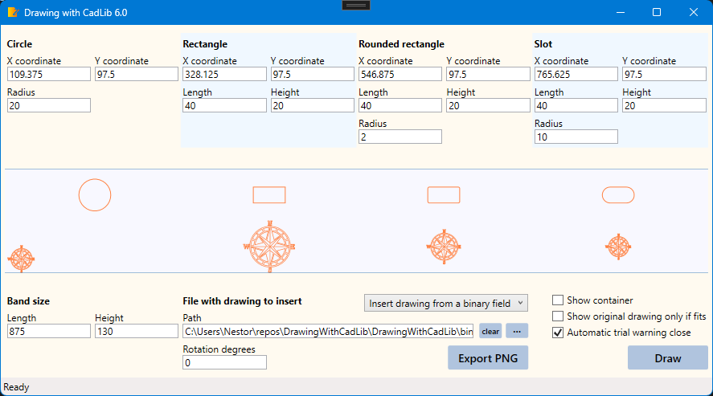

# Drawing with WoutWare CadLib

## Description

A basic learning about [WoutWare CadLib](https://www.woutware.com/) version 6.0.

This example code just draws some basic shapes on the screen and insert pre-existent drawings, useful as a proof of concept. 

Some code snippets were taken from the 
- [WoutWare Forum](https://www.woutware.com/forum)
- [WoutWare Documentation](https://www.woutware.com/doc/cadlib4.0/index.html)

## Screenshots

  

## Development platform

Visual Studio Community 2022 on Windows 11

[CadLib 6.0 for Windows Trial Version](http://www.woutware.com/download/CadLib6.0TrialSetup.exe)

You will need to [download](http://www.woutware.com/download/CadLib6.0TrialSetup.exe) and install the library. 

Then copy these files:

- WW.Cad.dll
- WW.dll

in .\DrawingWithCadLib\Libraries\CadLib6.0, before running the example code.

